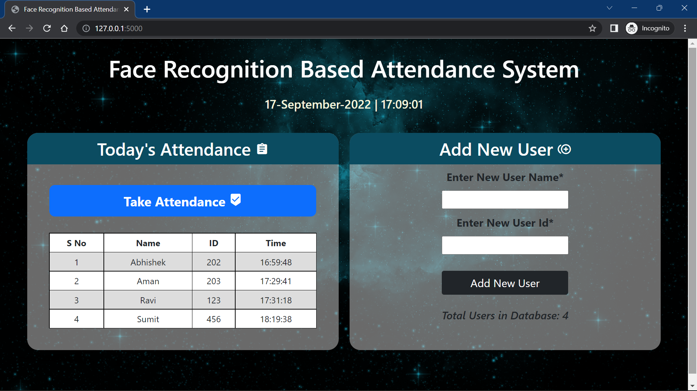

# Face Recognition Attendance System 🎓📸

A Face Recognition Attendance System that automatically records attendance using facial recognition technology. The system detects and recognizes faces from a webcam feed and marks attendance in a database or attendance file, eliminating the need for manual attendance tracking.

## 📖 Overview

This project uses Computer Vision and Machine Learning techniques to identify registered individuals and automatically mark their attendance. It improves accuracy, reduces manual effort, and prevents proxy attendance.

## ✨ Features

* Face Detection using OpenCV
* Face Recognition using Machine Learning
* Real-time Webcam Attendance
* Automatic Attendance Marking
* Student Registration and Training
* Attendance Records Storage
* Fast and Accurate Recognition

## 🛠️ Technologies Used

* Python
* OpenCV
* NumPy
* Pandas
* Face Recognition Library
* CSV/Database for Attendance Storage

## screenshot


## 📂 Project Structure

```text
face-recognition-attendance/
│
├── dataset/                # Training images
├── trainer/                # Trained model files
├── attendance/             # Attendance records
├── images/                 # Project images/screenshots
├── train.py                # Model training
├── attendance.py           # Attendance system
├── requirements.txt
└── README.md
```

## 🚀 Installation

### Clone Repository

```bash
git clone https://github.com/prs96k/face-recognition-attendance.git
cd face-recognition-attendance
```

### Install Dependencies

```bash
pip install -r requirements.txt
```

Or install manually:

```bash
pip install opencv-python
pip install numpy
pip install pandas
pip install face-recognition
```

## ▶️ Running the Project

### Step 1: Register Faces

Add training images to the dataset folder.

### Step 2: Train the Model

```bash
python train.py
```

### Step 3: Start Attendance System

```bash
python attendance.py
```

### Step 4: Mark Attendance

* Open webcam.
* Face is detected and recognized.
* Attendance is automatically recorded.

## 📊 Applications

* Schools and Colleges
* Universities
* Offices and Organizations
* Training Institutes
* Employee Attendance Management

## 🔒 Advantages

* Contactless Attendance
* Reduces Human Error
* Prevents Proxy Attendance
* Saves Time
* Improves Accuracy

## 🔮 Future Enhancements

* Cloud Database Integration
* Mobile Application Support
* Multiple Camera Support
* Real-time Notifications
* Face Mask Detection
* Dashboard Analytics

## 🤝 Contributing

Contributions are welcome. Feel free to fork the repository and submit pull requests.

## 📜 License

This project is intended for educational and learning purposes.

## 👨‍💻 Author

**Prerana**

GitHub: https://github.com/prs96k
